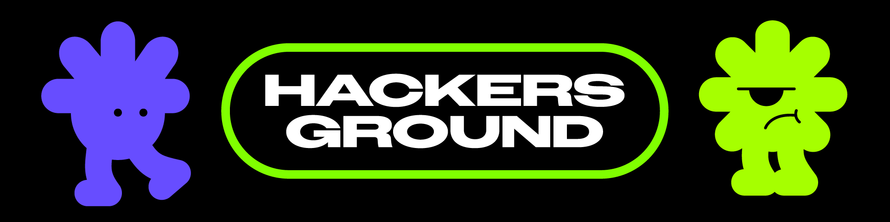
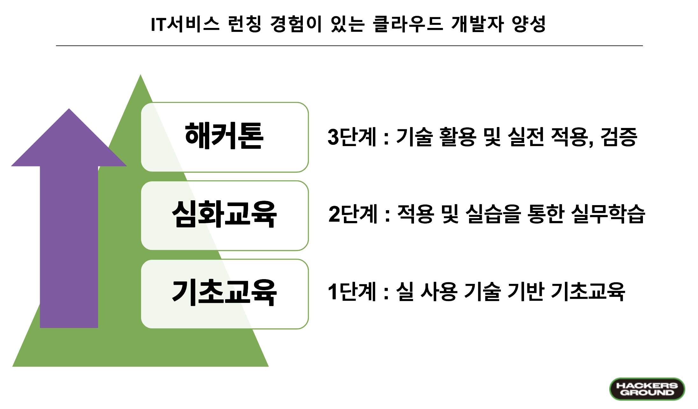

# 해커그라운드 해커톤 진행 과정 안내

반갑습니다, {{NAME}}님! 해커그라운드 조직위원회입니다. 이벤트를 신청해주셔 감사합니다.

  

[해커그라운드 해커톤](https://aka.ms/hackers-ground)은 대구/경북 지역의 청년개발자들과 함께 Microsoft 애저 클라우드를 활용해 당면한 현안 문제를 해결합니다. 이번 여름, 여러분께선 IT서비스를 클라우드로 런칭할 수 있는 경험을 얻어갈 수 있습니다.

## IT서비스 런칭 경험이 있는 클라우드 개발자 양성 과정

여러분들이 성장할 수 있는 과정을 준비했습니다. 해커톤까지 가기 위해선 아래 교육을 이수하고 과제를 통과하셔야 합니다. 상세 내용은 아래 문서를 읽어주세요. 이벤트 기한이 다가올 수록 내용이 자세하게 업데이트 됩니다.

1. [기초교육 - 클라우드 스킬 챌린지](../csc/README.md) - 7월
2. [심화교육 - 워크샵](../workshop/README.md) - 7월 말 ~ 8월 초
3. [해커톤](../hackathon/README.md) - 8월 말

  

## FAQ

진행하시며 어려운 부분들이 있으실 텐데 [FAQ 페이지](../faq/README.md)를 참고해주세요!

## 기존 참여자들과 소통하기

* [디스코드 소통채널 참여하기](https://aka.ms/hg/discord)
* [해커그라운드 공식홈페이지](https://aka.ms/hackers-ground)